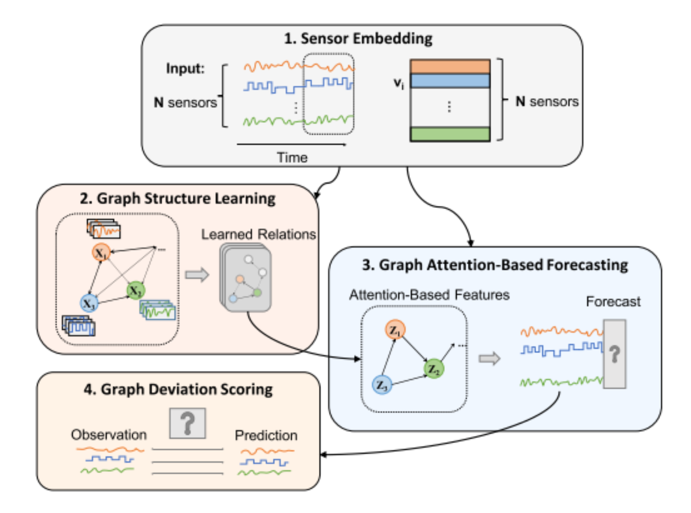

[comment]: # "This is the standard layout for the project, but you can clean this and use your own template"

# Structure Learning in Graph Attention Network based Network Anomaly Detection

#### Team

- E/17/044, Coralage D.T.S, [email](e17044@eng.pdn.ac.lk)
- E/17/251, Perera S.S, [email](e17251@eng.pdn.ac.lk)
- E/17/252,  Perera U.A.K.K, [email](mailto:e17252@eng.pdn.ac.lk)

#### Supervisors

- Prof. Roshan Ragel, [email](roshanr@eng.pdn.ac.lk)
- Dr. Suneth Namal, [email](sunethn@pdn.ac.lk)

#### Table of content

1. [Abstract](#abstract)
2. [Introduction](#introduction)
3. [Related works](#related-works)
4. [Methodology](#methodology)
5. [Experiment Setup and Implementation](#experiment-setup-and-implementation)
6. [Results and Analysis](#results-and-analysis)
7. [Conclusion](#conclusion)
8. [Links](#links)

## Abstract
Network anomaly detection is a critical aspect of ensuring the security and stability of differnt kinds of networks.
      Graph Attention Networks (GATs) have shown promise in modeling complex relationships within graph-structured data, making them well-suited for capturing intricate dependencies in network connections. This research introduces an innovative approach to enhance network anomaly detection through the incorporation of structure learning within GATs. The proposed method leverages the inherent ability of GATs to discern important nodes and edges in a network graph while introducing a mechanism for adaptive structure learning based on causality. By dynamically adjusting attention weights during the training process, our model autonomously identifies and prioritizes key structural nodes, facilitating a more robust representation of network behavior. This adaptability aims to improve the model's ability to discriminate between normal and anomalous network patterns while reducing the false detection rate.
    

## Introduction

Anomaly detection is the process of identifying deviations from what is considered normal behavior, a concept applicable across various disciplines. Over the years, researchers have employed diverse methods to detect anomalies in multivariate time series data. Modern  networks have increased in scale and complexity. This has led to the need for a proper self-operating network monitoring and detection mechanism to ensure the reliability of the network. Early approaches to network anomaly detection focused on rule-based systems that rely on predefined thresholds defined by network operators with expertise. However, these methods are limited in their ability to adapt to more diverse and complex networks. With the voyage of machine learning and data mining techniques, researchers began exploring statistical analysis and data-driven algorithms to identify anomalies. In recent years, network anomaly detection shifted towards more sophisticated approaches, including deep learning, neural networks, and graph-based approaches to model network anomalies in complex networks.

Deep learning models have gained popularity, particularly in complex networks with high-dimensional features. Surveys suggest that neural networks, augmented with attention mechanisms to capture dependencies in time series data, are more effective. Additionally, graph-based deep learning approaches excel in capturing potential dependencies between nodes, considering contextual information and improving prediction accuracy compared to methods overlooking the inherent graph structure of computer networks or treating all data uniformly.
Nevertheless, graph neural networks necessitate the input of the graph structure, posing a challenge in capturing intricate inter-sensor relationships and identifying anomalies deviating from these relationships. In our study, we scrutinize existing structure-learning approaches and propose a methodology for anomaly detection employing graph neural networks and causal-guided structure learning while reducing the false detections in the anomaly detection process.

## Related works
Historically, network anomaly detection research has predominantly concentrated on intrusion detection, leaving performance monitoring with limited consideration. This incongruity prompted our investigation into the fundamental differences between these two domains. The demarcation between them can be unclear, given the frequent intersection of security and reliability contexts. Anomalies related to performance usually result from malfunctions and misconfigurations, whereas security-related anomalies arise from deliberate malicious activities seeking to interfere with the regular functioning of a network.

An uncomplicated criterion for classifying network anomaly detection involves the method employed for anomaly detection. Over several decades of research, diverse methodologies have emerged, including statistical models, mathematical algorithms, as well as machine learning and deep learning approaches. Accrding to the researches in the early stages, the anomaly detection has employed statistical models based on mathematical algorithms like EWMA and Holt-Winters. The most of the work related to statistical approaches discusses the Gaussian Mixture model to estimate parameters based on EM algorithms and Bayesian networks. But researchers have drifted away from statistical approaches due to the limitations in feature representations and making assumptions. They have focused on machine learning based methodologies for anomaly detection. There are many researches for anomaly detection based on various machine learning techniques such as classfication, distance-based, clustering and etc. "A Machine Learning Framework for Network Anomaly Detection using SVM and GA", "Network Anomaly Detection Based on TCM-KNN Algorithm" and "Network anomaly detection by cascading k-Means clustering and C4.5 decision tree algorithm" are some of research work based on above mentioned techinques with algorithms Support Vector Machine, K-means clustering, random forests and K-Nearest Neighbors.

However, recent researches have pivoted towards the adoption of deep learning methodologies in response to the lack of support by traditional machine learning approaches for complex, diverse and high-dimensional features of networks. Anomaly detection in time series data can be divided into two categories of models known as forecasting-based models (LSTM, GNN) and reconstruction-based models (VAE, GAN). But according to many of survey papers related to network anomaly detection based on deep learning approaches, neural networks with attention layers have a higher capability of identifying the corelations among the time series data. But due to the lack of avialability of labeled datasets, focusing on unsupervised or semi-supervised learing models is more important.Therefore, there are several researches related to reconstruction-based semi-supervised oer unsupervised models such as "LSTM-Based VAE-GAN for Time-Series Anomaly Detection", "Usad: Unsupervised anomaly detection on multivariate time series" and "MAD-GAN: Multivariate Anomaly Detection for Time Series Data with Generative Adversarial Networks". Even though, these customized models do not align well with sequential data since those are poor in generalization and the false postive prediciation rates are at a significanly higher level. 

To overcome this major drawback, structure learinging can paly a major role in graph attention networks. The input graph structure to the training process can provide a significant effect on the final output of the model. In most of the researches, a structure of fully connected graph or selected top K correlated nodes has been used to decide the attention weights of the neighborhood among each nodes. But due to the false positive predicitions based on these structure learning approaches for the input layers, their precision is comparatively low. This can become an extra burdden on the industrial network systems practically. Therefore, our work is to provide a better structure learning mechanism to imporve the precision of graph attention networks while reducing the false positives.

## Methodology
Our methodology stands with the desire of providing a customized graph attention network with cause and effect structure learning mechanism. The feature behavior of each node is identified based on the embedding vectors and the future behavior will be decided with the predicitions made by the graph attention network. As the inital step, the system identifies the embedded vectors and the graph structure is learned based on the embedded vectors. Then, the defined graph structure is taken as the input layer of the graph attention network to make the predicitons. Finally, the anomoulousness of each node is forcasted based on the threshhold value defined with the previous observations. This methodology can be illustrated with the high-level digram in the figure 1.

 
##### Figure 1 : High-Level Diagram of the Methodology  

#### Structure Learning Approach (Causal-guided)
Causality is the main concept behind the structure learning approach we have followed. It can be refered as the estimation of a change in one node or variable with the contribution of the change in another node or node. Simply, the cause and effect relationship among two or more variables. This relationship is asymmetric and the estimation of the effect due to the change of the other varible is approximated over Causal Inference and the most suitable graph structure will be defined.

In the initial step, a fully connected graph is created, encompassing all nodes within the network. The significance of each edge in this fully connected graph is determined by iteratively removing individual edges and assessing the impact on prediction accuracy. Specifically, for a network with N nodes, this process results in the creation of N-1 submodels. Each submodel is derived by removing a distinct edge from each node, and the removed edge varies across the different submodels. Once the submodel is created, it undergoes processing through the Graph Neural Network (GNN) layers, producing predicted values for each node at the specific time 
t via the output layer. These predicted values are stored until the actual values from the network are received. Upon receiving the actual values, residuals are calculated by taking the difference between the previously predicted values and the actual values. The same process is repeated for the fully connected graph, generating a set of residuals.

Subsequently, an F-Test is conducted for the sets of residuals using an ANOVA table. This statistical analysis is employed to evaluate the significance of differences among the residual sets. Based on the results of the F-Test, the final graph structure is determined, taking into consideration the importance of each node in each submodel. Here, the F-Test is done based on the null hypothesis: there is no significant difference in the means of the residuals across different submodels

 
##### Figure 2 : Structure Learning Mechanism 

Moreover, the process of creating the input graph is not restricted to the training phase; instead, it is performed in each time window. This dynamic approach ensures that the most suitable graph structure is determined for predictions at each time window, contributing to the adaptability and effectiveness of the model.

## Experiment Setup and Implementation
Our experiment setup was implemented using PyTorch version 1.10.1 and CUDA 11.1, along with PyTorch Geometric Library version 2.0. The training phase occurred on a server equipped with an Intel(R) Xeon(R) CPU E5-1630 v3 @ 3.70GHz and a NVIDIA-SMI Tesla K40c graphics card. Training involved the Adam optimizer with a learning rate set at 0.001 and (β1 = 0.9, β2 = 0.99) values. Each experiment ran for 30 epochs, incorporating early stopping with a patience parameter of 10.

#### Dataset
Our model is assessed using the SWAT dataset, originating from a water treatment plant under Singapore's public utility board. Known as the Secure Water Treatment Dataset, SWAT mimics a realistic yet scaled-down Cyber-Physical System (CPS), merging digital and physical components. This dataset, encompassing 51 features, mirrors contemporary CPS applications in vital sectors such as power plants and IoTs. The training dataset involves 47,519 time steps, and the testing dataset consists of 44,990 time steps, with anomalies constituting 11.97% of the data. Table below provides a statistical summary of the dataset.
##### Table 1 
| Dataset | #Features | #Train | #Test | Anomalies |
|  SWaT | 47,519 | 44,990 | 11.97% |

## Results and Analysis
Table 2 illustrates all results obtained from experimenting with different structure learing approaches. 
   
##### Table 2 
| Method | Precision | Recall | F1 score |
|  Fully-connected graph | 0.1690 | 0.8450 | 0.2817 |
|  Neighborhood of top 20 similar nodes | 0.9219 | 0.6043 | 0.7301 |
|  Neighborhood of top 5 similar nodes | 0.9687 | 0.6549 | 0.7815 |
|  Causal connection learning | 0.9911 | 0.6701 | 0.7996 |

The findings reveal a tradeoff between recall and precision: explicit dependencies between nodes tend to increase recall but decrease precision. This emphasizes the crucial role of the graph of dependencies among nodes in balancing the enhancement of true positives against the reduction of false positives. Hence, there's a clear need for a well-crafted structure learning approach capable of learning connections that can generalize effectively to previously unseen data.

The introduction of causal connection learning notably elevates precision to 0.9911, accompanied by a recall of 0.6701. This outperformance against baselines results in the best overall F1 score. This highlights the effectiveness of incorporating causal connections among sensors, efficiently mitigating false alarms without compromising the detection rate.

## Conclusion
Our study delved into different strategies for structure learning, highlighting the significant influence of the explicit graph delineating dependencies among spatial variables in GNN-based anomaly detection. Recognizing its substantial impact on both detection and false alarm rates, we introduced a structured learning approach guided by causality. This method aims to effectively reduce false alarms while minimizing the impact on the detection rate, ultimately optimizing the F1 score.

However, it's essential to note that the runtime complexity of our introduced method is relatively high, given the creation of N-1 submodels when defining the ideal graph structure. To address this challenge, a potential solution is to explore and implement graph pooling techniques, serving as future extensions of this project. This enhancement could contribute to more efficient computations and overall improved performance.

## Links

[//]: # ( NOTE: EDIT THIS LINKS WITH YOUR REPO DETAILS )

- [Project Repository](https://github.com/cepdnaclk/e17-4yp-network-anomaly-detection)
- [Project Page](https://cepdnaclk.github.io/e17-4yp-network-anomaly-detection/ )
- [Department of Computer Engineering](http://www.ce.pdn.ac.lk/)
- [University of Peradeniya](https://eng.pdn.ac.lk/)

[//]: # "Please refer this to learn more about Markdown syntax"
[//]: # "https://github.com/adam-p/markdown-here/wiki/Markdown-Cheatsheet"